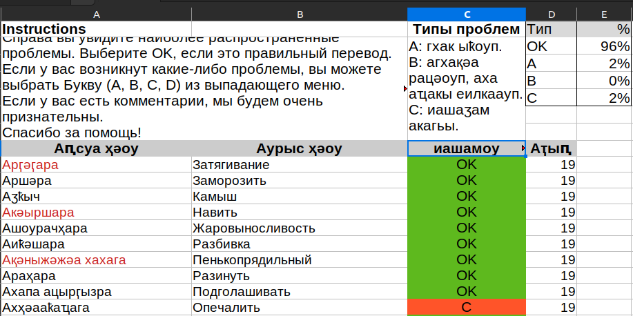

# Abkhazian focused Data Pipeline for Natural Language Processing(NLP)

## Description

This repository contains a data pipeline for monolingual and parallel corpuses used for Neural Machine Translation (NMT) and Speech To Text Tasks (STT). The data, which includes around 100 thousand parallel sentences, 100 thousand parallel words for Abkhazian-Russian pairs, and around 1.4 million sentences monolingual Abkhazian corpus, is sourced from various websites, ebooks, and a dictionary. Our team has obtained permissions from the content owners to open source all the text.

## Data ETL Pipeline

The data pipeline involves the process of extraction, transformation, and loading (ETL) to prepare the data for training neural network models.

### Extraction (This step is done for you, the information is provided in case)

The data acquisition process involves extracting information from various sources, employing diverse techniques to ensure comprehensive coverage. Specifically, the data is obtained through dictionary parsing using the `parse_dictionary.py` script.

For web content, a web scraping methodology is implemented, leveraging Scrapy spiders to simultaneously extract data from parallel web pages. Additionally, [`hunalign`](https://github.com/danielvarga/hunalign) is employed to perform heuristic text alignment across pages, optimizing the alignment process, the scripts can be found in the `scrapy` folder.

Furthermore, the content from ebooks is directly extracted from PDF documents.

### Transformation

The text is cleaned up to remove noise and identify outliers using Python and Shell scripts. This process involves feedback from 3 human evaluators and the implementation of random sampling for inferential statistics to identify outliers and potential sources of noise. Statistics can be found in the `data/stats` folder.



Different hyperparameters such as sentence length are used to filter out sentences. This process is repeated until a 95% accuracy is reached, meaning the sentences contain less than 5% error rate, including syntactical, grammatical, and semantical errors.

### Loading

The cleaned-up data is aggregated into a single file, ready to be passed further down the line for tokenization.

## Transform and load Abkhazian-Russian parallel data

```bash
git clone https://github.com/danielinux7/Abkhaz-NLP-Data-Pipeline.git
cd Abkhaz-NLP-Data-Pipeline
bash getclean_ab_ru.sh
```

## Transform and load Abkhazian Monolingual data

```bash
git clone https://github.com/danielinux7/Abkhaz-NLP-Data-Pipeline.git
cd Abkhaz-NLP-Data-Pipeline
bash getclean_ab.sh
```

The data will be created in the `clean` folder, the scripts will take some time to run(15-30min).
